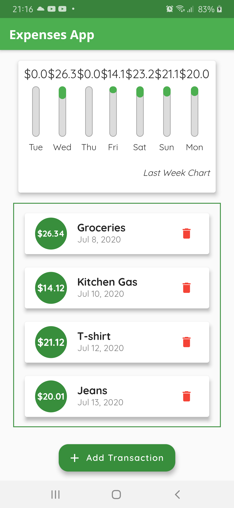
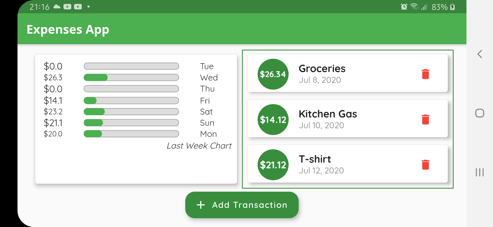
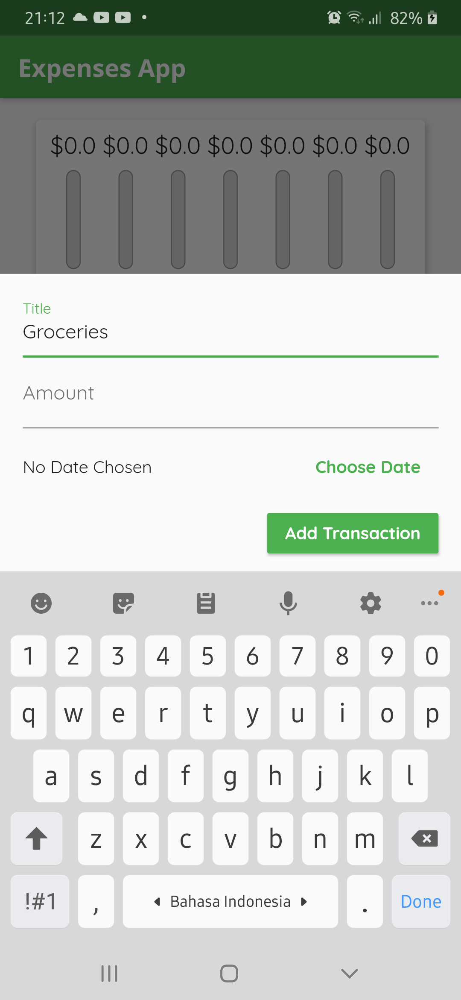
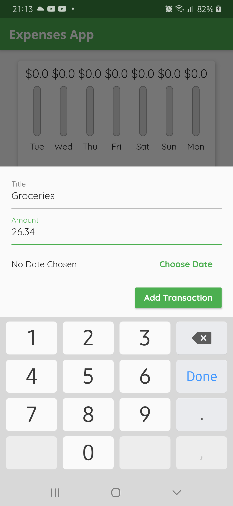
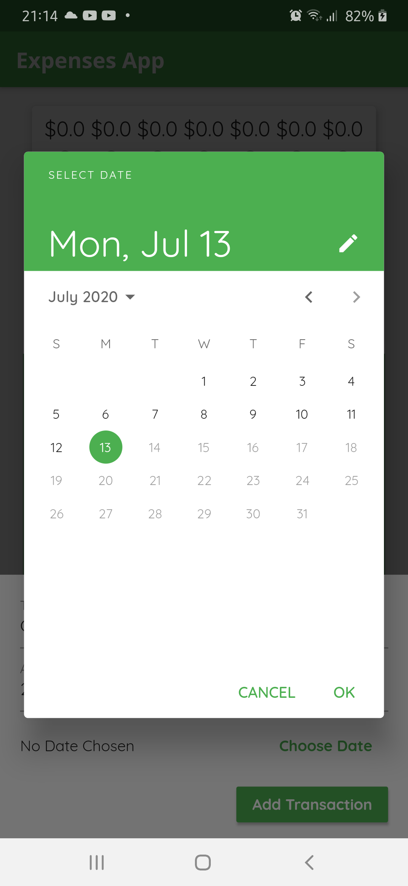

# Expenses_app

A simple management of personal expenses, developed with Flutter + Dart

## App Preview

- Portrait

    

- Landscape

    
  

- Create New Transaction

  

  

  

## How to Try

**Note:**

Make sure to have Flutter SDK and Dart in your code editor to be able to run this app

- Clone this repo
- Run Android / iOS emulator or connect your real devices (find out how to activate debugging mode for [Android](https://www.makeuseof.com/tag/what-is-usb-debugging-mode-on-android-makeuseof-explains/) and [iOS](https://support.youmail.com/hc/en-us/articles/204060346-How-to-Enable-or-Disable-Debug-Mode-on-the-iPhone-App))
- Run the command below to check the available devices
  ```
  flutter devices
  ```
- Run the command below to build in your emulator or real device
  ```
  flutter run
  ```

## Credits

- Screenshots captured from SM A505F

- Icon App by [Icons8 - US Dollar](https://icons8.com/icons/set/us-dollar)
